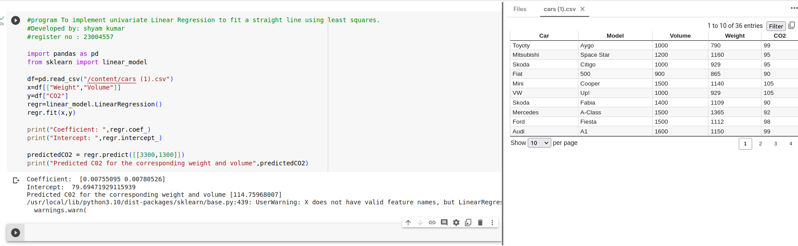

# Implementation of Multivariate Linear Regression
## Aim
To write a python program to implement multivariate linear regression and predict the output.
## Equipment’s required:
1.	Hardware – PCs
2.	Anaconda – Python 3.7 Installation / Moodle-Code Runner
## Algorithm:
### Step1
Import pandas and scikit-learn libraries.

### Step2
Reading the data from a CSV file.

### Step3
splitting yhe data into features (x) and target (y). 

### Step4
Creating and fitting the linear regression model.

### Step5
Printing the coefficient and intercept of the linear regression model.

### Step6
Making a prediction.

### Step6
printing the predicted CO2 emissions.

## Program:
```python
#program To implement univariate Linear Regression to fit a straight line using least squares.
#Developed by: shyam kumar
#register no : 23004557

import pandas as pd
from sklearn import linear_model

df=pd.read_csv("/content/cars (1).csv")
x=df[["Weight","Volume"]]
y=df["CO2"]
regr=linear_model.LinearRegression()
regr.fit(x,y)

print("Coefficient: ",regr.coef_)
print("Intercept: ",regr.intercept_)

predictedCO2 = regr.predict([[3300,1300]])
print("Predicted C02 for the corresponding weight and volume",predictedCO2)

```
## Output:


## Result
Thus the multivariate linear regression is implemented and predicted the output using python program.